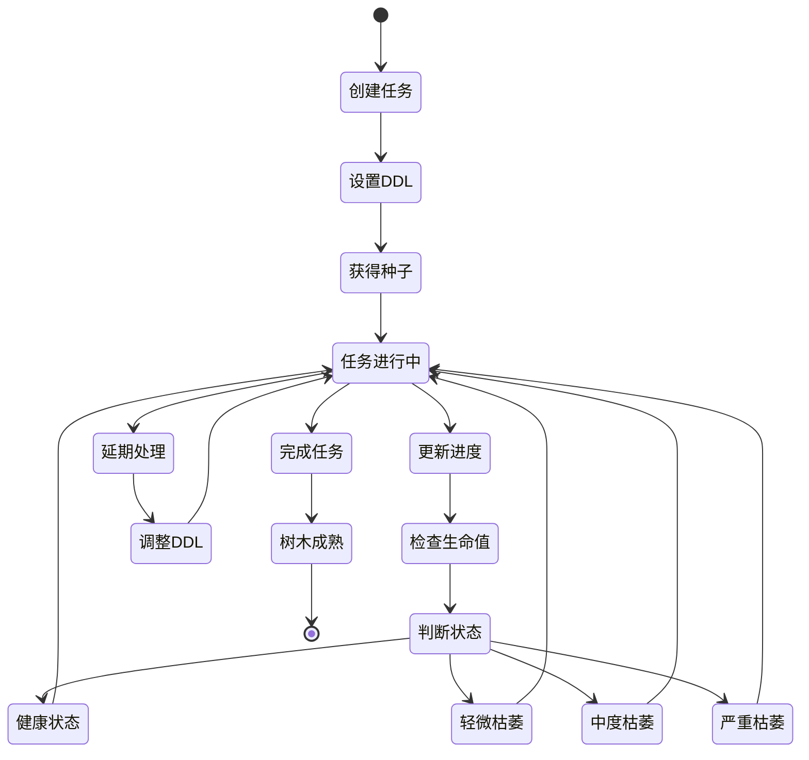
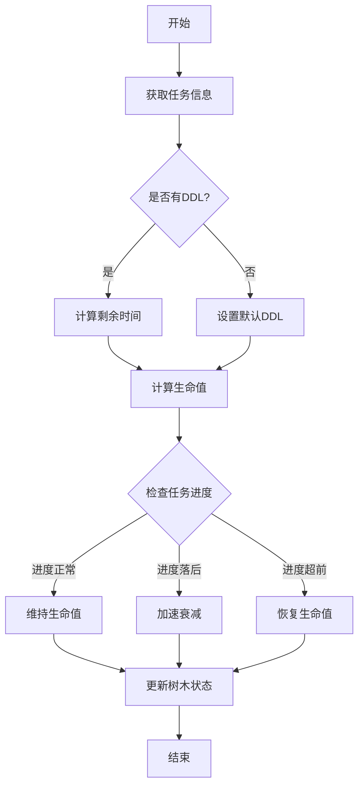
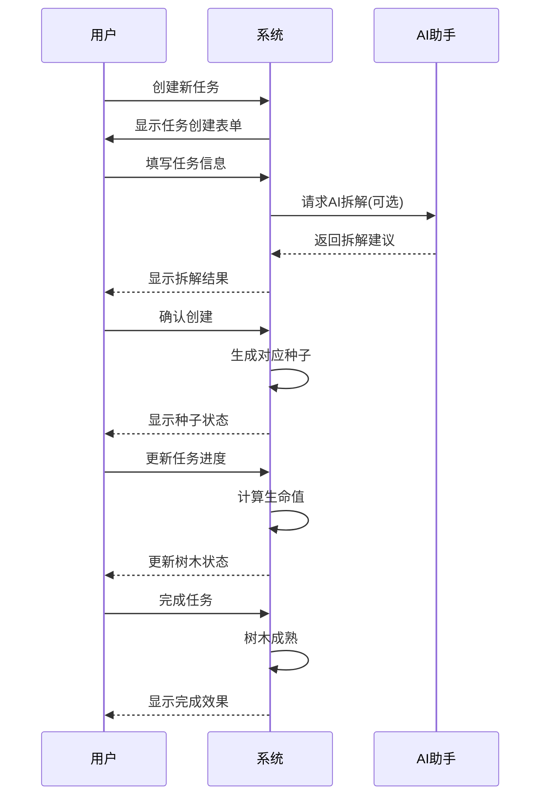
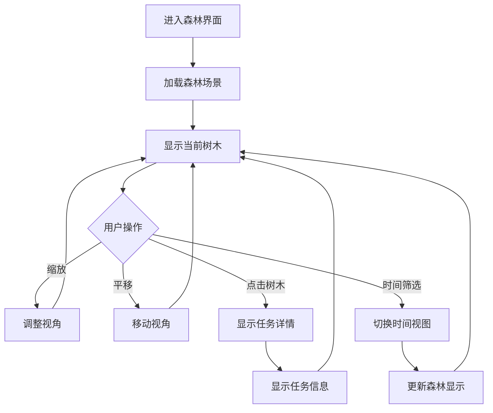
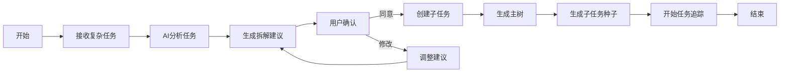
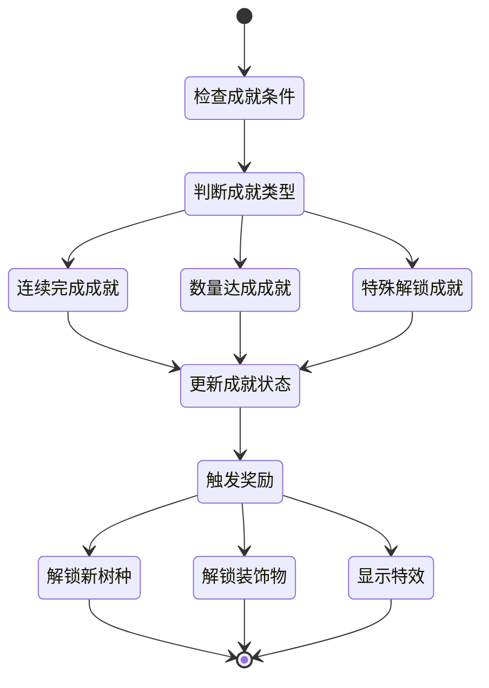
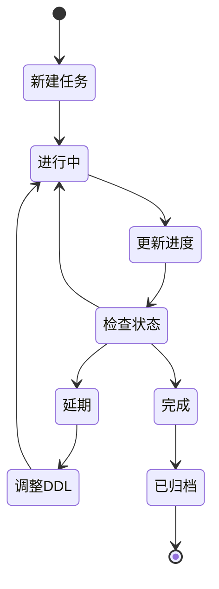

# TaskForest流程图说明

## 1. 任务生命周期流程

## 2. 生命值计算流程

## 3. 用户核心路径

## 4. 森林互动流程

## 5. AI任务拆解流程

## 6. 奖励系统流程

## 7. 任务状态转换流程

这些流程图展示了TaskForest的主要业务流程和状态转换。每个流程图都针对特定的功能模块，帮助开发团队更好地理解系统的运作方式。流程图使用mermaid语法编写，可以在支持mermaid的markdown查看器中直接渲染。

---
*本文档由产品设计师王芳负责维护，将根据产品开发进展持续更新* 