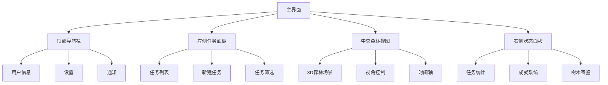
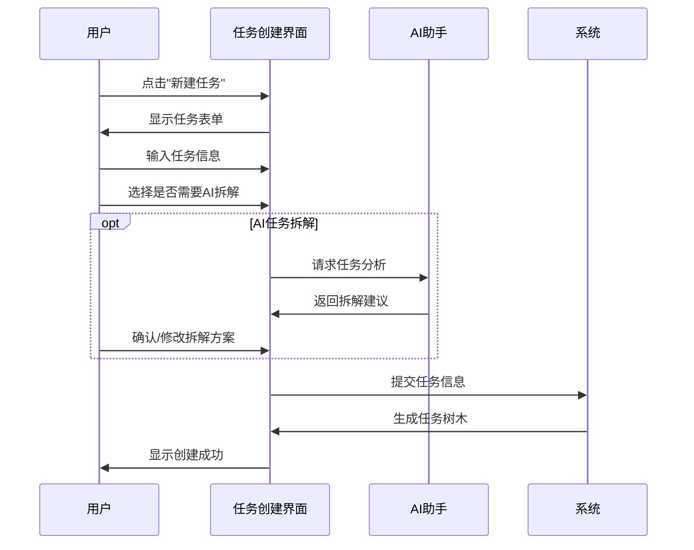
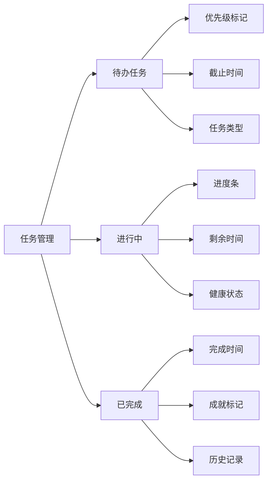
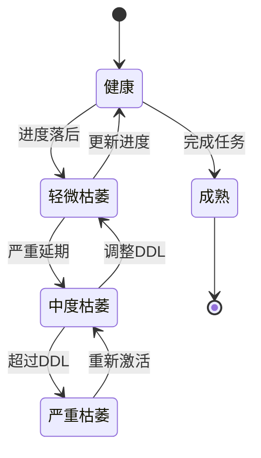
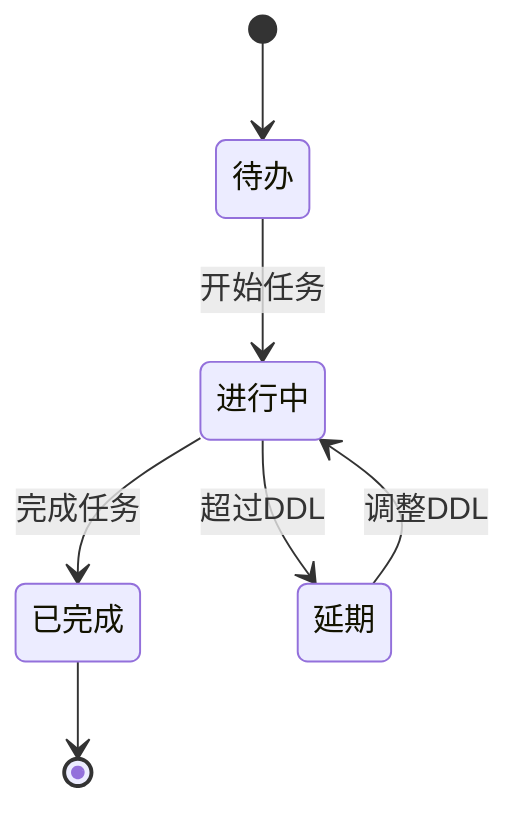

# TaskForest 产品原型设计

## 一、核心界面原型

### 1. 主界面布局



### 2. 任务创建流程



### 3. 任务管理界面



## 二、界面详细设计

### 1. 任务创建表单

```
+------------------------+
|     创建新任务         |
+------------------------+
| 任务名称：            |
| [                    ] |
+------------------------+
| 任务类型：            |
| [选择对应树木类型 v  ] |
+------------------------+
| 截止日期：            |
| [日期选择器          ] |
+------------------------+
| 任务优先级：          |
| ○ 低  ○ 中  ○ 高     |
+------------------------+
| 任务描述：            |
| [                    ] |
| [                    ] |
+------------------------+
| □ 需要AI任务拆解      |
+------------------------+
|  [取消]    [创建任务] |
+------------------------+
```

### 2. 森林视图控制

```
+------------------------+
|     森林视图控制      |
+------------------------+
|    [缩放] [旋转]      |
|    [平移] [重置]      |
+------------------------+
|     时间筛选          |
| [日] [周] [月] [年]   |
+------------------------+
|     视图模式          |
| [全部] [进行中] [完成]|
+------------------------+
```

### 3. 任务详情卡片

```
+------------------------+
|     任务详情          |
+------------------------+
| 任务名称：项目报告    |
| 类型：工作任务（枫树）|
| 创建时间：2024-03-20  |
| 截止时间：2024-03-25  |
+------------------------+
| 当前状态：进行中      |
| 生命值：75%           |
| [===========    ]     |
+------------------------+
| 子任务进度：          |
| - 数据收集 ✓          |
| - 分析报告 ⋯          |
| - 审核确认            |
+------------------------+
| [编辑] [完成] [删除]  |
+------------------------+
```

### 4. 成就系统界面

```
+------------------------+
|     成就中心          |
+------------------------+
| 已解锁树种：          |
| [橡树] [松树] [樱花树]|
| [枫树] [???] [???]    |
+------------------------+
| 当前成就：            |
| 🏆 任务达人           |
| ⭐ 准时之王           |
| 🌟 森林守护者         |
+------------------------+
| 下个目标：            |
| 解锁稀有树种：星光树  |
| 进度：7/10           |
+------------------------+
```

## 三、状态流转设计

### 1. 树木生命状态流转



### 2. 任务状态流转



## 四、交互设计说明

### 1. 基础交互原则
- 所有操作应在3次点击内完成
- 提供明确的视觉反馈
- 重要操作需二次确认
- 支持键盘快捷操作

### 2. 手势操作设计
- 双指缩放：调整森林视图大小
- 单指拖动：平移视角
- 双指旋转：调整视角角度
- 点击树木：显示任务详情
- 长按树木：进入编辑模式

### 3. 动画过渡效果
- 任务创建：种子落地生根动画
- 任务完成：树木绽放动画
- 状态切换：渐变过渡效果
- 视图切换：平滑移动效果

### 4. 反馈机制设计
- 操作成功：绿色提示+成功音效
- 操作失败：红色提示+警告音效
- 任务提醒：通知推送+树木闪烁
- 成就达成：庆祝动画+特殊音效

## 五、原型交互说明

### 1. 任务创建流程
1. 点击左侧面板"+"按钮
2. 填写任务基本信息
3. 选择是否需要AI拆解
4. 确认创建，观看种子种植动画
5. 任务出现在任务列表和森林中

### 2. 任务监控流程
1. 在森林中查看任务树木状态
2. 点击树木查看详细信息
3. 更新任务进度
4. 观察树木生命状态变化
5. 根据需要调整任务计划

### 3. 森林管理流程
1. 使用时间轴筛选显示范围
2. 调整视角浏览森林全景
3. 查看任务完成情况统计
4. 检查成就完成进度
5. 规划森林布局和发展

## 六、注意事项

### 1. 界面设计原则
- 保持界面简洁清晰
- 确保视觉层级合理
- 提供足够的操作反馈
- 保持交互一致性

### 2. 性能考虑
- 优化3D场景加载
- 控制动画效果数量
- 合理使用资源缓存
- 优化数据加载策略

### 3. 用户体验
- 提供新手引导教程
- 设计容错机制
- 支持操作撤销
- 保存用户使用习惯

---

*本文档由产品经理张明负责维护，将根据项目进展持续更新* 